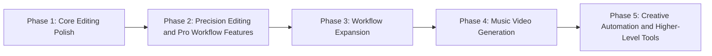

# ComfyStudio

ComfyStudio is a desktop animatic, previsualization, and AI-assisted editing tool built around a local ComfyUI workflow.

It combines a timeline editor, asset browser, Generate workspace, stock search, LM Studio prompt helper, and export queue in one app.

**Website:** [comfystudiopro.com](https://comfystudiopro.com)

## Roadmap

See the full roadmap in [ROADMAP.md](ROADMAP.md).



## Download

Most users should download the desktop app from the [GitHub Releases page](https://github.com/JaimeIsMe/comfystudio/releases).

The current public release is marked as a pre-release while early setup feedback comes in.

Desktop app release assets include:

- Windows installer
- Windows portable build
- macOS Apple Silicon DMG
- macOS Intel DMG

Advanced ComfyUI users can also optionally download the `Workflow Starter Pack` release asset to inspect workflows directly in ComfyUI and prepare dependencies manually before queueing inside ComfyStudio.

## What The Desktop App Includes

- The ComfyStudio desktop app
- Built-in workflow JSONs used by the app internally
- In-app dependency checks, setup guidance, and the Getting Started guide

## What The Desktop App Does Not Include

- ComfyUI itself
- Every custom node and model required for every workflow
- Real credentials such as Comfy account API keys or Pexels keys

## What It Does

- Edit projects with assets, preview, timeline, inspector, and export tools.
- Generate images, videos, and audio through curated local or cloud workflows.
- Use Director Mode to turn structured script input into keyframes and video shots.
- Search Pexels stock footage and stills directly from the app.
- Refine prompts locally with LM Studio.

## Core Product Decisions

- ComfyUI is local-only in this build. Remote and LAN ComfyUI targets are intentionally disabled.
- The default ComfyUI endpoint is `http://127.0.0.1:8188`, but users can override the port in Settings.
- LM Studio integration is local-only.
- Generate includes dependency preflight checks before queueing workflows.

## Desktop App Requirements

Minimum for normal app use:

- ComfyUI installed separately and running locally

Optional integrations:

- Pexels API key for the `Stock` tab
- Comfy account API key for paid partner-node workflows
- LM Studio for local prompt assistance in the `LLM` tab

## First Run

When you first open the app:

1. Choose a projects folder.
2. Create or open a project.
3. Open `ComfyStudio > Getting Started` from the bottom menu for the built-in setup and orientation guide.

The `Getting Started` guide is manual by design. It does not auto-open.

## ComfyUI Setup

ComfyStudio ships with built-in workflow JSON files, but that does not mean every workflow will work immediately on every machine.

Users still need the correct combination of:

- ComfyUI custom nodes
- model files
- local GPU capacity for local workflows
- partner API credentials for cloud workflows

### ComfyUI Port

- Default: `8188`
- Open `Settings > ComfyUI Connection` to change or test the local port.
- Only localhost or loopback addresses are accepted in this build.

### Dependency Checks

Inside `Generate`, choose a workflow and use the dependency check tools if something is missing.

The current workflow help flow includes:

- dependency preflight before queueing
- `Re-check`
- `Copy report`
- `Open node registry`
- `Open in ComfyUI`

## Generate Overview

### Single Mode

Use this for one-off image, video, or audio generations.

### Director Mode

Use this for a guided sequence:

1. `Setup`
2. `Script`
3. `Keyframes`
4. `Videos`

Director Mode supports a structured script format so the app can parse scene context, shot type, keyframe prompt, motion prompt, camera direction, and duration.

Example:

```text
Scene 1: Neon Arrival
Scene context: Futuristic transit terminal, blue and coral neon, reflective black tile, premium cinematic sneaker ad.

Shot 1:
Shot type: Wide shot
Keyframe prompt: Wide shot of the model stepping through sliding glass doors into a futuristic transit terminal, blue and coral neon reflecting across glossy black tile, coral-and-cream sneaker clearly visible.
Motion prompt: Starting from this exact keyframe, the model takes 2 confident steps forward while neon reflections slide across the floor. Keep the sneaker, outfit, and terminal lighting consistent.
Camera: Gentle backward tracking shot
Duration: 3
```

## Hardware Tiers

ComfyStudio tags workflows in `Generate` with a hardware tier to make setup expectations clearer.

| Tier | Meaning | Typical workflows | Practical guidance |
|---|---|---|---|
| Lite | Lower-end local GPU | Z Image Turbo, Music Generation | Often workable on 6-8 GB VRAM |
| Standard | Mid-range local GPU | Image Edit, Multiple Angles | Often needs 12-16 GB VRAM |
| Pro | Higher-end local GPU | WAN 2.2 image-to-video | Usually wants 24 GB+ VRAM |
| Cloud | Partner-node / credit-backed | Nano Banana 2 and other cloud workflows | Local VRAM is not the main constraint |

VRAM guidance is approximate. Resolution, frame count, model variant, batch size, and other running apps can change the real requirement significantly.

## Cloud Pricing Notes

Cloud workflows can display:

- estimated credits per run
- approximate USD conversion
- projected plan totals in Director Mode

For some workflows, pricing is dynamic. In those cases the UI shows a dynamic pricing label when the estimate is not fixed. Live account balance is not currently shown in-app.

## Stock and LLM Integrations

### Stock

The `Stock` tab uses Pexels.

- Add a Pexels API key in `Settings`.
- Search and import photos or videos directly into the current project.

### LLM

The `LLM` tab connects to LM Studio.

- Start LM Studio locally.
- Enable the local API server.
- Load a model.
- Use the model to refine prompts before generating.

If your GPU memory is tight, unload the LM Studio model before heavy ComfyUI generation.

## Workflow Starter Pack

The Workflow Starter Pack is optional and intended for advanced ComfyUI users who want a clearer dependency and workflow-prep path outside the app.

Advanced ComfyUI users can usually treat it like this:

1. Download the Workflow Starter Pack
2. Open the workflows in ComfyUI
3. Install any missing custom nodes
4. Download any missing models
5. Return to ComfyStudio and use `Generate`

Generate it with:

```bash
npm run starter-pack:build
npm run starter-pack:package
```

Generated files:

- `docs/workflow-starter-pack/starter-pack.manifest.json`
- `docs/workflow-starter-pack/INDEX.md`
- `docs/workflow-starter-pack/docs/workflows/*.md`
- `docs/workflow-starter-pack/workflows/local/*.comfyui.json`
- `docs/workflow-starter-pack/workflows/cloud/*.comfyui.json`

See:

- `docs/workflow-starter-pack/README.md`
- `docs/workflow-starter-pack/INDEX.md`
- `docs/workflow-starter-pack/docs/WHERE_FILES_GO.md`
- `docs/workflow-starter-pack/docs/API_KEYS.md`
- `docs/workflow-starter-pack/docs/TROUBLESHOOTING.md`

## Run From Source (Developers Only)

If you want to develop or contribute to ComfyStudio, run it from source with Electron:

### Windows

```bash
npm install
npm run electron:dev
```

### macOS

```bash
npm install
npm run electron:dev
```

The packaged desktop app is the intended experience for most users. Browser-only `npm run dev` is still useful for frontend work, but Electron is the normal development path.

## Build Commands

```bash
npm run build
npm run electron:build:win
npm run electron:build:mac
npm run electron:build:linux
```

Packaged artifacts are written to `release/`.

### Building the Linux app with Docker

You can build the Linux version (AppImage and .deb) on any host (including macOS or Windows) using Docker, so you get native Linux binaries without cross-compilation:

```bash
./scripts/docker-build-linux.sh
```

Or manually:

```bash
docker build --platform linux/amd64 -f Dockerfile.linux-build -t comfystudio-linux-build .
docker run --platform linux/amd64 --rm -v "$(pwd)/release:/out" comfystudio-linux-build sh -lc "cp -R /app/release/. /out/"
```

Artifacts appear in `release/`.

If your network uses TLS interception (common on corporate proxies) and Docker fails with `x509: certificate signed by unknown authority`, pass your root CA into the build:

```bash
export CUSTOM_CA_CERT_B64="$(base64 -i /path/to/corp-root-ca.crt)"
./scripts/docker-build-linux.sh
```

The script forwards `CUSTOM_CA_CERT_B64` to the Docker build and installs it into the container trust store.

## Known Constraints

- ComfyUI is local-only in this build.
- Some workflows require manual model or custom-node installation on the user's ComfyUI machine.
- Cloud pricing can be dynamic for certain partner workflows.
- Live partner credit balance is not currently shown in-app.

## Contributing

See `CONTRIBUTING.md`.

## License

MIT. See `LICENSE`.
